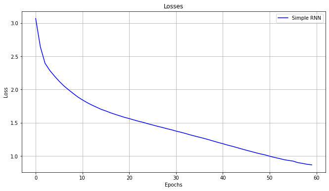
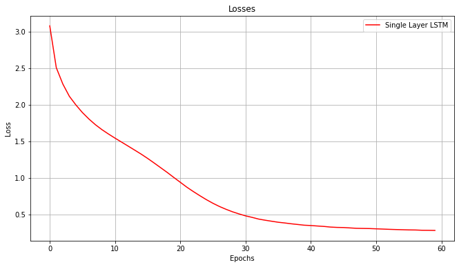
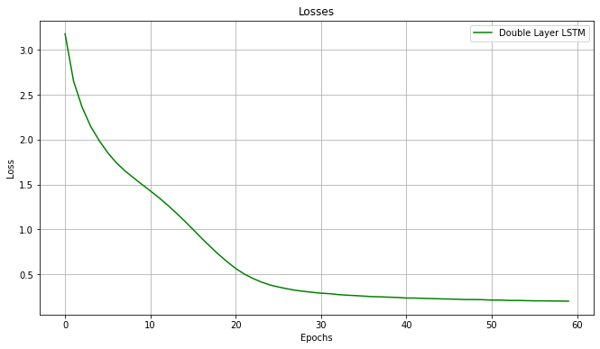
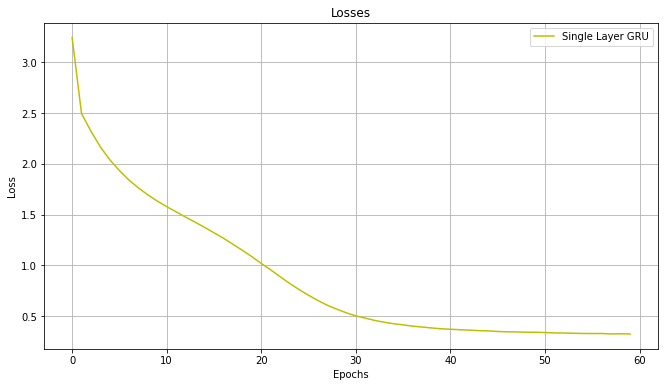
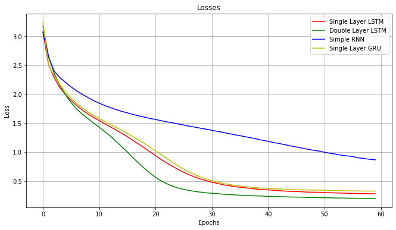

# Отчет по лабораторной работе "Генерация последовательностей"

### ФИО, Группа
Номер в группе: 1, Вариант: 1 ((остаток от деления (1-1) на 6)+1)

### Цель работы

В данной лабораторной работе предстоит научиться генерировать последовательности с помощью рекуррентных нейронных сетей. В качестве последовательности в случае
моего варианта выступает проза на русском языке, элемент последовательности - один символ. В работе нужно исследовать 4 различных архитектуры нейросетей :
Обычная полносвязная RNN, Однослойная LSTM, Двухслойная LSTM, Однослойный GRU, построить их модели, обучить на некотором наборе данных и с их помошью
сгенерировать отрывок текста.

### Используемые входные данные

Для обучения я использовал книгу Федора Абрамова "Дом" с сайта http://lib.ru/. В обучающий набор можно так же добавить ещё несколько книг, чтобы данных было больше, однако книга
Федора Абрамова оказалась достаточно большой, и чтобы сети не обучались слишком долго, я решил оставить только одну книгу.

### Предварительная обработка входных данных

Первым делом была загружена книга с помощью tf.keras.utils.get_file и преобразована в одну большую строку с помошью функции text_from_file. У полученной строки я обрезал неачало и конец, так как
там была информация о книге, которая бы только засорила датасет, и эту строку перевёл в нижний регситр, чтобы уменьшить словарный запас. Далее был создан словарь (уникальные символы), числами закодироны
все уникальные символы, и, соответсвенно числами закодирован весб  текст.
```
# создадим словарь уникальных символов
vocabulary = sorted(list(set(raw_text)))

# преобразуем уникальные символы в числа
char2idx = {u:i for i, u in enumerate(vocabulary)}

# обратное преобразование
idx2char = np.array(vocabulary)

# преобразуем текст из символов в числа
text_to_int = np.array([char2idx[c] for c in raw_text])
```

Затем была проведена токенизация, данные были перемешаны и разделены на батчи.
 
### Эксперимент 1: RNN


#### Архитектура сети

```
rnn = Sequential([
                  Embedding(n_vocab, 256,
                            batch_input_shape=[batch_size, None]),
                  SimpleRNN(1024,
                            return_sequences=True,
                            stateful=True,
                            recurrent_initializer='glorot_uniform'),
                  Dense(n_vocab)
                  ])

rnn.summary()
```

```
Model: "sequential_2"
_________________________________________________________________
Layer (type)                 Output Shape              Param #   
=================================================================
embedding_2 (Embedding)      (64, None, 256)           17408     
_________________________________________________________________
simple_rnn (SimpleRNN)       (64, None, 1024)          1311744   
_________________________________________________________________
dense_2 (Dense)              (64, None, 68)            69700     
=================================================================
Total params: 1,398,852
Trainable params: 1,398,852
Non-trainable params: 0
_________________________________________________________________
```


#### Результат



Результат генерации 
```
ранним утром и волючой братья, и к сену воз у  михаила  из кон, - это горят, всех пол,  что  расческве
ивановна
```

#### Вывод по данному эксперименту

Полносвязная RNN обучилась быстрее всех, однако сгенерировала двольного таки посредственную последовательность с множеством орфографических ошибок и отсутствием смысла. Так же
у полносвязной RNN самое большое значение функции потерь за 60 эпох.

### Эксперимент 2: Однослойная LSTM


#### Архитектура сети

```
lstm_sing =  Sequential([
                         Embedding(n_vocab, 256,
                                   batch_input_shape=[batch_size, None]),
                         LSTM(1024,
                              return_sequences=True,
                              stateful=True,
                              recurrent_initializer='glorot_uniform'),
                         Dense(n_vocab)
                         ])
lstm_sing.summary()
```

```
Model: "sequential"
_________________________________________________________________
Layer (type)                 Output Shape              Param #   
=================================================================
embedding (Embedding)        (64, None, 256)           17408     
_________________________________________________________________
lstm (LSTM)                  (64, None, 1024)          5246976   
_________________________________________________________________
dense (Dense)                (64, None, 68)            69700     
=================================================================
Total params: 5,334,084
Trainable params: 5,334,084
Non-trainable params: 0
_________________________________________________________________
```
#### Результат



Результат генерации 
```
ранним утром петр прибежали к тебе,
в городе в низу заговорила - ухмылким мотала рукой
пряслины! - в заулок орет
```

#### Вывод по данному эксперименту

Однослойная LSTM обучалась дольше, чем Полносвязная RNN (забегая наперёд, дольше чем Однослойный GRU), но сгенерировала текст практически без орфографических ошибок, связными словами и даже со
смысловой связкой в начале предложения. Значение функции потерь ниже, чем у Полносвязной RNN (приемерно такое же, как у Однослойного GRU).

### Эксперимент 3: Двухслойная LSTM


#### Архитектура сети

```
lstm_double =  Sequential([
                         Embedding(n_vocab, 256,
                                   batch_input_shape=[batch_size, None]),
                         LSTM(1024,
                              return_sequences=True,
                              stateful=True,
                              recurrent_initializer='glorot_uniform'),
                         LSTM(1024,
                              return_sequences=True,
                              stateful=True,
                              recurrent_initializer='glorot_uniform'),
                         Dense(n_vocab)
                         ])
lstm_double.summary()
```

```
Model: "sequential_1"
_________________________________________________________________
Layer (type)                 Output Shape              Param #   
=================================================================
embedding_1 (Embedding)      (64, None, 256)           17408     
_________________________________________________________________
lstm_1 (LSTM)                (64, None, 1024)          5246976   
_________________________________________________________________
lstm_2 (LSTM)                (64, None, 1024)          8392704   
_________________________________________________________________
dense_1 (Dense)              (64, None, 68)            69700     
=================================================================
Total params: 13,726,788
Trainable params: 13,726,788
Non-trainable params: 0
_________________________________________________________________
```

#### Результат



Результат генерации 
```
ранним утром вором орать.
     наконец по лестнице с зажженным фонарем михаил начал спускаться в  одну  коровенк
```

#### Вывод по данному эксперименту

Двухслойная LSTM обучалась дольше всех архитектур. Сгенерированный текст имеет смысл, слова более-менее связаны, орфографических ошибок почти нет. За 60 эпох
Двухслойная LSTM обучилась с наименьшим значением функции потерь


### Эксперимент 4: Однослойный GRU


#### Архитектура сети

```
gru_sing = Sequential([
                  Embedding(n_vocab, 256,
                            batch_input_shape=[batch_size, None]),
                  GRU(1024,
                      return_sequences=True,
                      stateful=True,
                      recurrent_initializer='glorot_uniform'),
                  Dense(n_vocab)
                  ])

gru_sing.summary()
```

```
Model: "sequential_3"
_________________________________________________________________
Layer (type)                 Output Shape              Param #   
=================================================================
embedding_3 (Embedding)      (64, None, 256)           17408     
_________________________________________________________________
gru (GRU)                    (64, None, 1024)          3938304   
_________________________________________________________________
dense_3 (Dense)              (64, None, 68)            69700     
=================================================================
Total params: 4,025,412
Trainable params: 4,025,412
Non-trainable params: 0
_________________________________________________________________
```

#### Результат



Результат генерации 
```
ранним утром отвернулась от меня... пришлось  бежать  за
помощникам приехал? поком  он  впол всем заил. -
узнал 
```

#### Вывод по данному эксперименту

Однослойный GRU обучался быстрее, чем обе архитектуры LSTM, немного медленнее, чем полносвязная RNN. Сгенерированный текст на мой взляд получился самым связанным и наполненным смылсом, кроме концовки За 60 эпох
Однослойный GRU обучился примерно с таким же значением функции потерь, как однослойная LSTM

#### Графики функции потерь всех архитектур




### Выводы

В результате работы были построены 4  нейронные сети с различными рекуррентными слоями. Если сравнивать результат между ними, то я бы расположил их так : Однослойный GRU, Двухслойная LSTM,
 Однослойная LSTM, Полносвязная RNN.
 
 Если же сравнить полученный сгенерированный текст с тем, который производит человек, видно, что результат очень далёк не только от идеала, но и в целом от хорошего связного текста. Грамматически 
 предложения построены неплохо, орфографические ошибки встречаются, но не так часто, это говорит о том, что сети научились связывать буквы в слова, но довольно таки плохо связывают слова между собой
 с точки зрения смысловой нагрузки.
 
 Такой результат получился из-за нескольких факторов в совокупности. Первое, рассмотренные архитектуры достаточно просты. Второе, модели могли переобучиться на этих данных. И наконец, как мне кажется, главная проблема - 
 это датасет. На примере лабораторной работы NN1 я уже убедился, насколько важна чистота и качество датасета для нейронной сети. В этой же лабораторной работе я довольно тривиально почистил данные, использовал только одну 
 книгу, кодировал символы как обычный label_encoder, хотя можно было использовать ван-хот кодирование. Всё это соответсвенно сказалось на точности.
 
 Так же в процессе выполнения работы я освоил сервис Google Colab. До этого момента я всё выполнял локально на своём ПК, он довольно таки слабый, но этого вполне хватало. Когда я начал обучать первую нейронную сеть из
 этой лабораторной работы, я понял, что придётся долго ждать и перешёл в Google Colab, в котором сети обучались значительно быстрее.
 
 
 
 
 
 